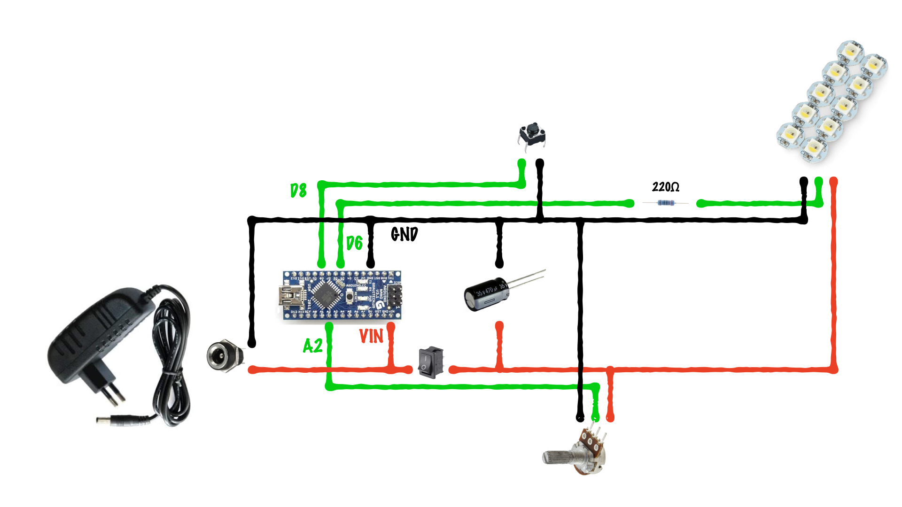

# nightlight_minecraft_stone
Code arduino pour la gestion des leds de ma veilleuse Minecraft RedStone

Le code utilise la bibliothèque **Adafruit_NeoPixel**. Pour pouvoir l'utiliser, rendez vous dans votre IDE Arduino dans le menu *Outils > Gérer les bibliothèques*. Dans le champ de recherche tapez le mot clé **adafruit_neopixel**. Cliquez ensuite sur le bouton **Installer** sur la bibliothèque **Adafruit NeoPixel** dans la liste.

Pensez à adapter la variable **PixelCount** en indiquant le nombre de pixel que vous souhaitez contrôler.

Le pin D6 est utilisé pour contrôler les pixels
Le pin D8 permet de connaître l'état d'un bouton utilisé pour changer de mode
Le pin A2 lui retourne l'état d'un potentiomètre

Pour plus de détails, voiçi le schéma du montage correspondant au programme : 
